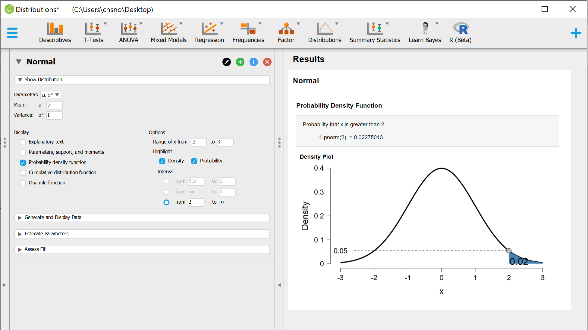

Some of my notes on Statistics

See [./stats.ipynb](./stats.ipynb)

----
P-value

> A **low p-value** can give us a statistical evidence to **support rejecting the null hypothesis**, but it does not prove that the alternative hypothesis is true. <br>
> If you use an alpha level of 0.05, there's a 5% chance you will incorrectly reject the null hypothesis.
> - [Source](https://blog.minitab.com/blog/understanding-statistics/three-common-p-value-mistakes-youll-never-have-to-make#:~:text=A%20low%20p%2Dvalue%20provides,incorrectly%20reject%20the%20null%20hypothesis)

- Shapiro-Wilk (normality test) - the null hypothesis is that the population is normally distributed.

----
**Suitability for parametric testing**

Sample skew and kurtosis (Cole Davis, Statistical Testing, 2019):

- N<50 within 1.96 (or -1.96)
- N<300 within 3.29
- N>300 use plots

Sample skew and kurtosis [Statistical Analysis in JASP - A Students Guide v1.0.pdf](https://static.jasp-stats.org/Statistical%20Analysis%20in%20JASP%20-%20A%20Students%20Guide%20v1.0.pdf)

- Skewness Z = skewness / Skewness standard error 
- Kurtosis Z = kurtosis / kurtosis standard error

**Z score significance:** 

- p<0.05 if z >1.96 
- p<0.01 if z >2.58 
- p<0.001 if z >3.29 

E.g. The data is significantly skewed if p<0.05

See also:

- [brownmath](https://brownmath.com/stat/shape.htm) 
- [EXPLORING DATA INTEGRITY](https://static.jasp-stats.org/Statistical%20Analysis%20in%20JASP%20-%20A%20Students%20Guide%20v1.0.pdf)
----

```
dnorm(x, mean = 0, sd = 1, log = FALSE)
pnorm(q, mean = 0, sd = 1, lower.tail = TRUE, log.p = FALSE)
qnorm(p, mean = 0, sd = 1, lower.tail = TRUE, log.p = FALSE)
rnorm(n, mean = 0, sd = 1)
```

 - **d**norm gives the density. *what's the probability the outcome will be x?*
 - **p**norm gives the distribution function. *what's the probability value will be less than x or between x and y?*
 - **q**norm gives the quantile function. *what value does x percent of the population fall between?*
 - **r**norm generates random deviates. 

[Examples](http://statweb.stanford.edu/~susan/courses/s141/Rlab2sol/)
---
### PDF




### CDF

The cumulative probability plot displays the **cumulative** distribution of a random variable.

### Quantile


----

Normal distribution equation

```
x <- seq(-5, 5, by=0.1)
y = (1/sqrt(2*pi))*exp(-x^2/2)
plot(x,y)
lines(x, y)
```

or 

```
x <- seq(-5, 5, by=0.1)
y <- dnorm(x,mean=0,sd=1)
plot(x,y,type="l",lwd=2,col="red")
```

[Source](http://msenux2.redwoods.edu/MathDept/R/StandardNormal.php)

----

Normality

```
hist(cars$speed)

# ...

qqnorm(cars$speed)
qqline(cars$speed)
```

----

Probability of a random variable following a gaussian distribution to be smaller than a value

```
pnorm(0, mean = 0, sd = 1)
1] 0.5
```

E.g. percentage of values falling between -1.2 and 1.2 standard deviations:

```
pnorm(1.2) - pnorm(-1.2)
[1] 0.7698607
```

See also: http://msenux2.redwoods.edu/MathDept/R/StandardNormal.php

----

[R] How to Calculate Percentage of Data within certain SD of Mean [Source](https://stat.ethz.ch/pipermail/r-help/2012-February/302515.html)

```
# Read Data
nb10 <- read.table("http://www.adjoint-functors.net/su/web/314/R/NB10") 

# Calculate Stats
total = length(nb10[,1])
mean = mean(nb10[,1])
sd = sd(nb10[,1])

# Function ... nSD is the number of SD you are looking at
pData <- function(nSD){
  lo = mean - nSD/2*sd
  hi = mean + nSD/2*sd
  percent = sum(nb10[,1]>=lo & nb10[,1]<=hi)/total *100
}

# Output ... 
print(paste("Percent of data within 2 SD is ",pData(2),"%", sep=""))  # 86%
print(paste("Percent of data within 3 SD is ",pData(3),"%", sep=""))  # 93%
print(paste("Percent of data within 4 SD is ",pData(4),"%", sep=""))  # 96%
print(paste("Percent of data within 5 SD is ",pData(5),"%", sep=""))  # 97%
print(paste("Percent of data within 6 SD is ",pData(6),"%", sep=""))  # 98%
```

----

Correlation

> r = average((x in standard units) * (y in standard units))

or

> r = cov(x, y)/(sd(x) * sd(y))

where

> cov(x, y) = (average of products xy) - (average of x) * (average of y)

```
x = 1:7
y = c(2,1,4,3,7,5,6)

plot(x,y)

x.z = scale(x)
y.z = scale(y)
prod = x.z * y.z

sum(prod) / (length(prod)-1) # [1] 0.8214286
cor(x, y)                    # [1] 0.8214286

sum((x - mean(x)) * (y - mean(y))) / (length(x) - 1)   # 3.833333
cov(x, y)                                              # 3.833333
cov(x, y) / (sd(x)*sd(y))    # [1] 0.8214286
```

----

Correlation intuition

```
# y = mx + c

c = 3
m = 2

x = 1:7
y = 3*x + c + rnorm(x)

plot(x,y)
abline(lm(y ~ x))

abline(v=mean(x), lty=3)
text(x=1.25, y=mean(y), label='AVG y')

abline(h=mean(y), lty=3)
text(x=mean(x), y=7, label='AVG x')

x0 = mean(x)    ; x1 = mean(x) + sd(x)
y0 = mean(y)    ; y1 = mean(y)

arrows(x0, y0, x1, y1, length=0.1)
text(x=x0 + 1, y=y0-1, label='SD x')

x0 = mean(x) + sd(x)   ; x1 = mean(x) + sd(x)
y0 = mean(y)           ; y1 = mean(y) + sd(y)

arrows(x0, y0, x1, y1, length=0.1)
text(x=x1 + 0.25, y=y0+3, label='SD y', srt=90)
```


----

Regression based on correlation and standard deviation

```
require(MASS)

num_values = 50
reqd_corr = 0.5

out <- mvrnorm(num_values, 
               mu = c(0,0), 
               Sigma = matrix(c(1,reqd_corr,reqd_corr,1), ncol = 2),
               empirical = TRUE)

out = as.data.frame(out)

rownames(out) = 1:50
colnames(out) = c('x', 'y')

plot(out$x, out$y)
abline(lm(out[,2] ~ out[,1]))

mean_x = mean(out$x)
mean_y = mean(out$y)

points.default(mean_x, mean_y, type="p", pch=4, col="red", cex=4)

sd_x1 = sd(out$x)
sd_y1 = sd(out$y)

x1 = 1
y1 = reqd_corr * sd_y1

points.default(x1, y1, type="p", pch=4, col="red", cex=4)
```


